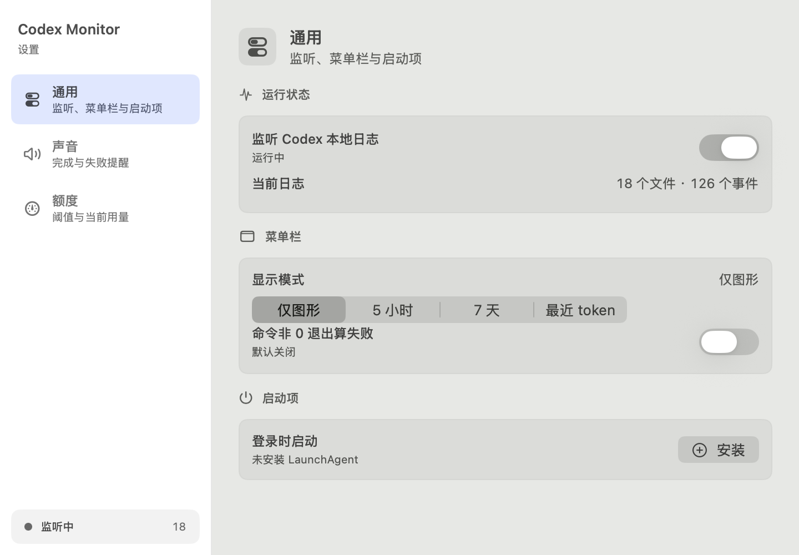

# Codex Monitor

[](https://github.com/whitewooood/codex-extra/actions/workflows/swift.yml)
[](https://github.com/whitewooood/codex-extra/releases)
[](docs/INSTALL.md)
[](LICENSE)

中文 | [English](#english)

Codex Monitor 是一个轻量的 macOS 菜单栏工具：它把 Codex Desktop 写在本机的会话日志变成可扫一眼的用量条，并在任务完成或失败时播放本地提示音。

适合你在后台跑 Codex、切去做别的事、又不想反复回来看任务是否结束；也适合想随时看 5 小时和 7 天用量窗口的人。

> 非官方工具：本项目不属于 OpenAI 或 Codex 官方产品。它只读取本机 `~/.codex/sessions` 日志，不上传数据，也不查询云端账单 API。




## 亮点

- 菜单栏单色双用量条：上方显示 5 小时窗口，下方显示 7 天窗口。
- 下拉面板显示最近 token、累计 token、上下文窗口、剩余额度与重置时间。
- 最近 6 小时 token 消耗趋势和最近 session 用量排行。
- Codex 任务完成时播放完成提示音。
- 检测到失败、受阻、超时或取消时播放失败提示音。
- 提示音完全本地播放，不依赖 macOS 通知声音是否生效。
- Preferences 窗口支持登录项、菜单栏显示模式、用量阈值和自定义完成/失败声音。

## 下载

下载最新版：

[GitHub Releases](https://github.com/whitewooood/codex-extra/releases/latest)

优先下载 `CodexMonitor-<version>-macOS.dmg`，打开后把 `Codex Monitor.app` 拖到 Applications。也可以下载 `CodexMonitor-<version>-macOS.zip` 手动解压使用。

当前 release 使用 ad-hoc 签名，尚未 Apple notarized。macOS 可能提示无法验证开发者，见 [签名说明](docs/SIGNING.md)。

## 要求

- macOS 13 或更新版本。
- Codex Desktop 已运行，并且本机存在 `~/.codex/sessions` 会话日志。
- 从源码构建时需要 Xcode Command Line Tools。

## 从源码运行

```bash
git clone https://github.com/whitewooood/codex-extra.git
cd codex-extra
./script/build_and_run.sh
```

脚本会构建并启动 `~/Applications/Codex Monitor.app`。更多安装方式见 [安装文档](docs/INSTALL.md)。

## 常驻菜单栏

安装到当前用户的 Applications 目录：

```bash
./script/build_and_run.sh --install
```

安装登录项，开机登录后自动启动：

```bash
./script/build_and_run.sh --install-login-item
```

移除登录项：

```bash
./script/build_and_run.sh --uninstall-login-item
```

登录项使用 `~/Library/LaunchAgents/com.whitewood.codex-monitor.plist`，不会修改系统级目录。

## 用量来自哪里

Codex Monitor 读取 Codex Desktop 写入本机 JSONL 日志里的 `token_count` 事件，并显示：

- 当前会话累计 token。
- 最近一次 token 消耗。
- 模型上下文窗口。
- 5 小时和 7 天窗口的使用百分比及重置时间。

这不是 Codex 官方稳定 API。如果 Codex Desktop 后续调整本地日志格式，本项目可能需要跟随更新。

## 隐私

这个工具是 local-only：

- 不上传 Codex 日志。
- 不发送遥测。
- 不调用云端账单或用量 API。
- 不修改 Codex Desktop 设置。
- 偏好设置保存在当前用户的 `UserDefaults`。

详情见 [隐私说明](docs/PRIVACY.md)。

## 开发

运行测试：

```bash
swift test
```

严格并发检查：

```bash
swift test -Xswiftc -strict-concurrency=complete -Xswiftc -warnings-as-errors
```

打包 release：

```bash
./script/package_release.sh
```

发布流程见 [docs/RELEASING.md](docs/RELEASING.md)，配置说明见 [docs/CONFIGURATION.md](docs/CONFIGURATION.md)。

## 贡献

欢迎提交 issue 和 pull request。开始前请阅读 [CONTRIBUTING.md](CONTRIBUTING.md)。

## 许可证

MIT. See [LICENSE](LICENSE).

---

## English

[中文](#codex-monitor) | English

Codex Monitor is a lightweight macOS menu bar app that turns local Codex Desktop session logs into glanceable usage bars, and plays local sounds when a task completes or fails.

It is useful when Codex is running in the background and you want to step away without repeatedly checking whether the task is done. It also gives you a quick view of the 5-hour and 7-day usage windows.

> Unofficial tool: this project is not an OpenAI or Codex official product. It only reads local `~/.codex/sessions` logs, does not upload data, and does not call a cloud billing API.


## Highlights

- Monochrome dual usage bars in the menu bar: 5-hour window above, 7-day window below.
- Dropdown panel for recent tokens, total tokens, context window, remaining usage, and reset times.
- Recent 6-hour token trend and recent session usage ranking.
- Completion sound when Codex finishes a task.
- Failure sound when a task fails, gets blocked, times out, or is cancelled.
- Fully local audio alerts that do not depend on macOS notification sounds.
- Preferences window for login item, menu bar display mode, usage thresholds, and custom completion/failure sounds.

## Download

Download the latest version:

[GitHub Releases](https://github.com/whitewooood/codex-extra/releases/latest)

Prefer `CodexMonitor-<version>-macOS.dmg`: open it and drag `Codex Monitor.app` to Applications. A `CodexMonitor-<version>-macOS.zip` archive is also available for manual installation.

Release artifacts are ad-hoc signed and not Apple notarized yet. macOS may warn that the developer cannot be verified. See [Signing](docs/SIGNING.md).

## Requirements

- macOS 13 or newer.
- Codex Desktop running with local `~/.codex/sessions` logs.
- Xcode Command Line Tools when building from source.

## Run From Source

```bash
git clone https://github.com/whitewooood/codex-extra.git
cd codex-extra
./script/build_and_run.sh
```

The script builds and launches `~/Applications/Codex Monitor.app`. See [Installation](docs/INSTALL.md) for more options.

## Persistent Menu Bar App

Install to the current user's Applications directory:

```bash
./script/build_and_run.sh --install
```

Install a login item so the app starts after sign-in:

```bash
./script/build_and_run.sh --install-login-item
```

Remove the login item:

```bash
./script/build_and_run.sh --uninstall-login-item
```

The login item uses `~/Library/LaunchAgents/com.whitewood.codex-monitor.plist` and does not modify system-level directories.

## Where Usage Comes From

Codex Monitor reads `token_count` events from local Codex Desktop JSONL logs and displays:

- Total tokens for the current session.
- Most recent token usage.
- Model context window.
- Usage percentages and reset times for the 5-hour and 7-day windows.

This is not an official stable Codex API. If Codex Desktop changes its local log format, this project may need to be updated.

## Privacy

This tool is local-only:

- It does not upload Codex logs.
- It does not send telemetry.
- It does not call cloud billing or usage APIs.
- It does not modify Codex Desktop settings.
- Preferences are stored in the current user's `UserDefaults`.

See [Privacy](docs/PRIVACY.md) for details.

## Development

Run tests:

```bash
swift test
```

Strict concurrency checks:

```bash
swift test -Xswiftc -strict-concurrency=complete -Xswiftc -warnings-as-errors
```

Build release artifacts:

```bash
./script/package_release.sh
```

See [docs/RELEASING.md](docs/RELEASING.md) for the release process and [docs/CONFIGURATION.md](docs/CONFIGURATION.md) for configuration details.

## Contributing

Issues and pull requests are welcome. Please read [CONTRIBUTING.md](CONTRIBUTING.md) before getting started.

## License

MIT. See [LICENSE](LICENSE).
