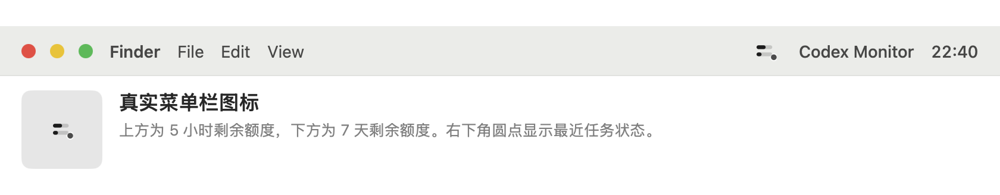
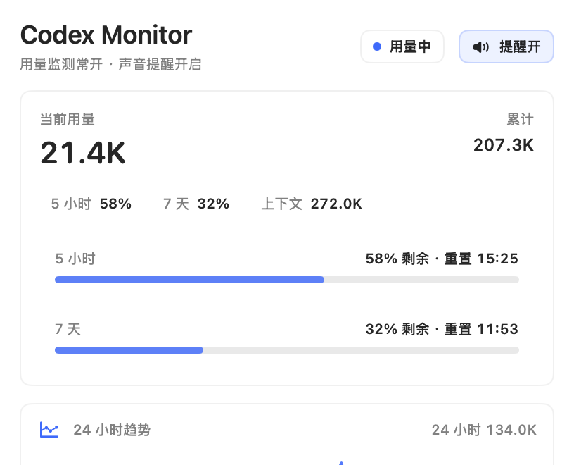

# Codex Monitor

[](https://github.com/whitewooood/codex-extra/actions/workflows/swift.yml)
[](https://github.com/whitewooood/codex-extra/releases)
[](docs/INSTALL.md)
[](LICENSE)

中文 | [English](#english)

Codex Monitor 是一个 macOS 菜单栏工具，用来查看 Codex Desktop 的本地用量日志，并在任务完成或失败时播放提示音。

它不是 OpenAI 或 Codex 官方项目。它只读取本机的 `~/.codex/sessions`，不上传日志，也不调用云端账单 API。





## 功能

- 菜单栏显示 5 小时和 7 天用量窗口。
- 下拉面板显示最近用量、累计用量、剩余额度、重置时间、24 小时趋势和最近 3 个会话排行。
- Codex 任务完成时播放完成提示音；失败、受阻、超时或取消时播放失败提示音。
- 可设置完成/失败声音、音量、安静时段、登录时启动和菜单栏显示模式。
- 可选检查 GitHub Releases 更新；默认关闭，不会自动下载或安装。

## 安装

下载最新版：

[GitHub Releases](https://github.com/whitewooood/codex-extra/releases/latest)

推荐下载 `CodexMonitor-<version>-macOS.dmg`，打开后把 `Codex Monitor.app` 拖到 Applications。也提供 zip 版本。

当前 release 使用 ad-hoc 签名，尚未 notarized。macOS 可能提示无法验证开发者，处理方式见 [SIGNING.md](docs/SIGNING.md)。

要求：

- macOS 13 或更新版本。
- 已运行过 Codex Desktop，并生成 `~/.codex/sessions` 日志。

## 从源码运行

需要 Xcode Command Line Tools。

```bash
git clone https://github.com/whitewooood/codex-extra.git
cd codex-extra
./script/build_and_run.sh
```

安装到当前用户的 Applications 目录：

```bash
./script/build_and_run.sh --install
```

安装登录项：

```bash
./script/build_and_run.sh --install-login-item
```

移除登录项：

```bash
./script/build_and_run.sh --uninstall-login-item
```

更多安装细节见 [INSTALL.md](docs/INSTALL.md)。

## 数据来源

Codex Monitor 读取 Codex Desktop 本地 JSONL 日志里的 `token_count`、`task_complete` 等事件。

目前会显示：

- 最近一次 token 用量。
- 当前会话累计 token。
- 模型上下文窗口。
- 5 小时和 7 天窗口的使用百分比及重置时间。

这不是 Codex 官方稳定 API。如果 Codex Desktop 改变本地日志格式，本项目可能需要更新。

## 隐私

- 不上传 Codex 日志。
- 不发送遥测。
- 不调用云端账单或用量 API。
- 不修改 Codex Desktop 设置。
- 偏好设置保存在当前用户的 `UserDefaults`。
- 自动检查更新默认关闭；开启后只请求 GitHub Releases latest API。

详情见 [PRIVACY.md](docs/PRIVACY.md)。

## 开发

运行测试：

```bash
swift test
```

严格并发检查：

```bash
swift test -Xswiftc -strict-concurrency=complete -Xswiftc -warnings-as-errors
```

打包 release：

```bash
./script/package_release.sh
```

相关文档：

- [CONFIGURATION.md](docs/CONFIGURATION.md)
- [RELEASING.md](docs/RELEASING.md)
- [CONTRIBUTING.md](CONTRIBUTING.md)

## 许可证

MIT. See [LICENSE](LICENSE).

---

## English

[中文](#codex-monitor) | English

Codex Monitor is a macOS menu bar app for local Codex Desktop usage logs. It shows the 5-hour and 7-day usage windows, and can play local sounds when a Codex task completes or fails.

This is not an official OpenAI or Codex project. It reads local `~/.codex/sessions` files only. It does not upload logs or call a cloud billing API.

## Features

- Menu bar usage meter for the 5-hour and 7-day windows.
- Dropdown panel with recent tokens, total tokens, remaining usage, reset times, 24-hour trend, and top 3 recent sessions.
- Local completion and failure sounds.
- Preferences for custom sounds, volume, quiet hours, launch at login, and menu bar display mode.
- Optional GitHub Releases update check, off by default.

## Install

Download the latest release:

[GitHub Releases](https://github.com/whitewooood/codex-extra/releases/latest)

Use `CodexMonitor-<version>-macOS.dmg` for normal installation. Open it and drag `Codex Monitor.app` to Applications. A zip archive is also available.

Release artifacts are ad-hoc signed and not notarized yet. See [SIGNING.md](docs/SIGNING.md).

Requirements:

- macOS 13 or newer.
- Codex Desktop with local `~/.codex/sessions` logs.

## Build From Source

```bash
git clone https://github.com/whitewooood/codex-extra.git
cd codex-extra
./script/build_and_run.sh
```

Run tests:

```bash
swift test
```

Build release artifacts:

```bash
./script/package_release.sh
```

## Privacy

Log parsing and sound playback are local. Codex Monitor does not upload Codex logs, send telemetry, call billing APIs, or modify Codex Desktop settings. See [PRIVACY.md](docs/PRIVACY.md).

## License

MIT. See [LICENSE](LICENSE).
